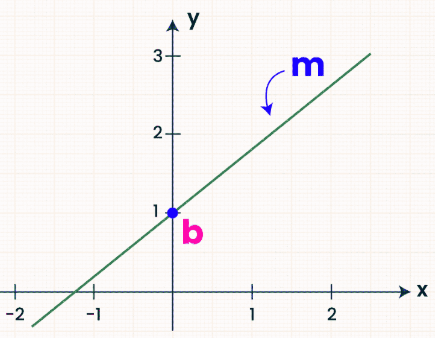
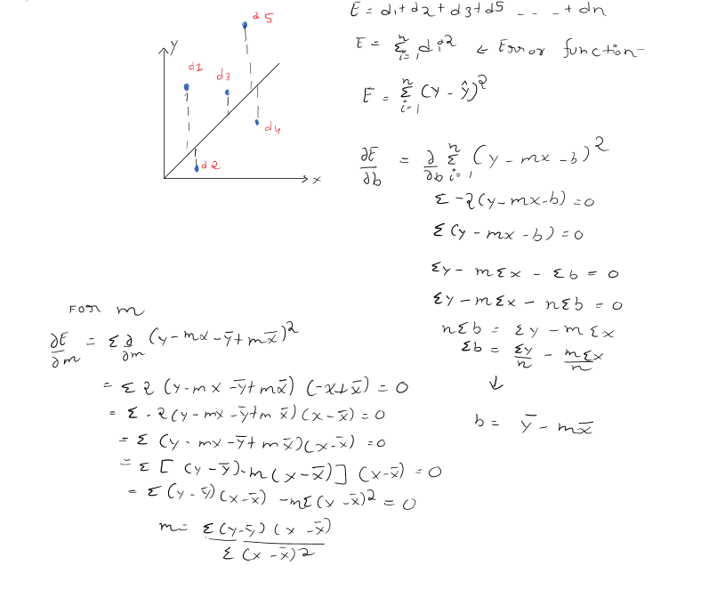

# Linear Regression

Linear regression is a supervised machine learning algorithm that models the relationship between a dependent output variable and one or more independent input variables by fitting a straight line.

Basically, in linear regression we use an independent variable to predict a dependent variable. In linear regression, we create a "best fit" line — a line that passes as close as possible to all the points, minimizing the distance between each point and the line.

# Two main variants of linear regression

Most people talk about two types of linear regression models: **simple** and **multiple**. The difference is based on the number of features (independent variables) used.

1. **Simple linear regression** — one independent variable, one dependent variable.
2. **Multiple linear regression** — more than one independent variable.

Both work on continuous numeric targets, like predicting house prices.

Related to linear regression (but a separate algorithm) is **logistic regression**, used for classification problems — like spam vs. not-spam. Linear regression and logistic regression both belong to a broader family called **Generalized Linear Models (GLMs)**, but logistic regression is not "a type of" linear regression — it's fit differently and outputs probabilities through a sigmoid (or softmax, for multiple classes) rather than a raw continuous value.

For now, let's focus on simple linear regression.

# Simple Linear Regression Model

In simple linear regression, we have one independent variable and one dependent variable. For example: CGPA is the independent variable and package (salary) is the dependent variable. Or: experience is the independent variable and salary is the dependent variable.

If you're thinking "package and salary probably depend on other features too" — you're right, and that's a good instinct! But for now, we're focused on understanding the simple regression model.

**Note:** Asking "obvious" questions isn't a bad thing — it helps you understand a topic more deeply. :)

Now, here's the math you need to know:

# Linear Algebra

1. **The Slope-Intercept Equation:** Understanding y = mx + b inside and out.
2. **y** is the target you are predicting.
3. **x** is your input feature.
4. **m (Slope):** How much y changes for every 1-unit increase in x.
5. **b (Y-intercept):** The value of y when x is zero.



People often struggle to understand slope and intercept intuitively. Here's a simple way to picture it using a chess analogy:

Think of the line as a piece on a chessboard.

1. **b** (the intercept) moves like a rook restricted to one direction — it only slides the line up or down, without changing its angle.
2. **m** (the slope) works like a rotation — but with a twist: it doesn't rotate around the center of the board. It rotates around a fixed point: (0, b), the y-intercept itself.

So **b** sets the anchor point, and **m** decides the angle the line swings around that anchor.

# Basic Statistics (Mean and Spread)

Because the regression line is essentially a "moving average," you need to understand how numbers relate to their averages.

1. **Mean (x̄ and ȳ):** The average values of your data. The final regression line is guaranteed to pass exactly through the point (x̄, ȳ).
2. **Variance and Standard Deviation:** How spread out your data points are from their averages.
3. **Covariance and Correlation (r):**
   - Does y go up when x goes up? (Positive correlation)
   - Does y go down when x goes up? (Negative correlation)
   - How strong or weak is that relationship?

# Calculus
1. **Derivative** = slope at a point. You already used "slope" for m — same idea, just at any point on a curve, not just a straight line.
2. At the lowest point of a curve, the slope is flat (zero). This is why we set ∂E/∂b = 0 and ∂E/∂m = 0 in your derivation — we're finding the bottom of the error "bowl," where it can't get any lower.
3. **Partial derivative** = take the derivative of one variable, freeze the other. Your error E depends on both m and b, so when you do ∂E/∂b, you treat m like a fixed number for that step, and vice versa. 
4. The "2" that appears in your derivation comes from a basic calculus rule (chain rule) for differentiating squared terms — don't need to explain the rule itself, just note where that 2 comes from so it's not "magic." 

# Creating Simple Linear Regression From Scratch

The slope-intercept equation is y = mx + b, where y is the dependent variable, x is the independent variable, m is the slope, and b is the intercept. The model's predictions depend entirely on the values of m and b.

Imagine you want to create a secret recipe to predict how much a house will cost.

A straight line is made of two ingredients that never change once fitted: the **Base Ingredient (b)** and the **Multiplier (m)**.

- **b (the intercept)** is your starting point — like the bare minimum cost of a house, even with zero square feet. It's the floor price.
- **m (the slope)** is your multiplier — how many extra dollars get added for every additional square foot.

Once you calculate these two ingredients from your data, they become fixed constants. Now you have a "magic calculator": anyone can give you any house size (x), and since m and b are locked in, you just plug in x, multiply, and hand back the predicted price (y).

There are two ways to find m and b:
1. **Closed-form solution** — Ordinary Least Squares (OLS), solved directly with a formula.
2. **Non-closed-form solution** — Gradient Descent, solved iteratively. (We'll cover this in a future post!)

For now, let's derive the OLS formula.

**Note:** Why do we square the errors instead of just summing them? Because positive and negative errors would cancel out, sometimes giving a misleadingly small (even zero) total error. Squaring fixes that.

You might also ask: why not use absolute value instead of squaring? You could — but absolute value isn't differentiable at error = 0 (it creates a sharp "V" shape at that point). Squaring creates a smooth parabola that's differentiable everywhere, including at zero, which is what makes calculus-based optimization possible.

### Deriving the formula



Starting from the error function:

E = Σ(y - ŷ)² = Σ(y - mx - b)²

Setting ∂E/∂b = 0 and solving gives:

**b = ȳ - mx̄**

Substituting that back in and setting ∂E/∂m = 0 gives:

**m = Σ(y - ȳ)(x - x̄) / Σ(x - x̄)²**

### A quick worked example

Say we have 5 students with these CGPA (x) and package-in-LPA (y) values:

| CGPA (x) | Package (y) |
|----------|--------------|
| 6.5      | 3.0          |
| 7.0      | 3.8          |
| 7.5      | 4.2          |
| 8.0      | 5.0          |
| 8.5      | 5.5          |

- x̄ = 7.5, ȳ = 4.3
- Σ(x - x̄)(y - ȳ) = (-1)(-1.3) + (-0.5)(-0.5) + (0)(-0.1) + (0.5)(0.7) + (1)(1.2) = 1.3 + 0.25 + 0 + 0.35 + 1.2 = **3.1**
- Σ(x - x̄)² = 1 + 0.25 + 0 + 0.25 + 1 = **2.5**
- **m = 3.1 / 2.5 = 1.24**
- **b = 4.3 - (1.24 × 7.5) = 4.3 - 9.3 = -5.0**

So the fitted line is: **package = 1.24 × CGPA − 5.0**

A student with CGPA 9.0 would be predicted a package of (1.24 × 9.0) − 5.0 = **6.16 LPA**.

# Code

**Manual implementation (from scratch):**

```python
import numpy as np
import pandas as pd

'''We can split the dataset with train_test_split, or manually. 
Let's first do it manually.'''

df = pd.read_csv('placement.csv')  # two columns: one feature, one label
shuffled_data = df.sample(frac=1, random_state=2).reset_index(drop=True)

# frac=1 means 100% of the data gets shuffled.
# random_state=2 ensures we get the same shuffle every time we run the code
# (without it, the split would be different each run).

train_size = int(0.8 * len(shuffled_data))
train_set = shuffled_data[:train_size]
test_set = shuffled_data[train_size:]

num = sum((train_set['cgpa'] - train_set['cgpa'].mean()) * (train_set['package'] - train_set['package'].mean()))
dem = sum((train_set['cgpa'] - train_set['cgpa'].mean()) ** 2)
m = num / dem
b = train_set['package'].mean() - m * train_set['cgpa'].mean()

def predict(x):
    return m * x + b

print(m)
print(b)
```

**Using scikit-learn (for comparison):**

```python
import pandas as pd
from sklearn.model_selection import train_test_split
from sklearn.linear_model import LinearRegression

df = pd.read_csv('placement.csv')
x = df.iloc[:, :1]
y = df.iloc[:, -1:]

X_train, X_test, y_train, y_test = train_test_split(x, y, test_size=0.2, random_state=2)

lr = LinearRegression()
lr.fit(X_train, y_train)

print(lr.coef_)
print(lr.intercept_)
```

Comparing the two: the manual version's `m` and `b` should land close to sklearn's `coef_` and `intercept_` — small differences are expected since the train/test split is randomized differently in each version.

> **Key takeaway: `random_state` doesn't work the way people assume**
>
> `random_state` is a seed that makes a shuffle *reproducible* — run the code again with the same seed, and you get the same result back. But using the **same** `random_state` value across different libraries does **not** guarantee the same split.
>
> Why? The seed only fixes the random number generator's starting point — it doesn't fix the *shuffling algorithm*. pandas' `.sample()` and sklearn's `train_test_split()` both sit on top of NumPy's RNG, but each consumes it in a different internal sequence. Same seed, different algorithm → different shuffle order → different train/test rows → different m and b.
>
> **Proof, using `random_state=2` in both versions:**
> - Manual (pandas `.sample`) → b = **-1.078**
> - sklearn (`train_test_split`) → intercept_ = **-0.896**
>
> Same seed number, different results — because they're different shuffling methods under the hood, not the same method with two names. `random_state` guarantees reproducibility *within* one function across runs — it does not guarantee two different libraries will agree just because you gave them the same numbe

---


